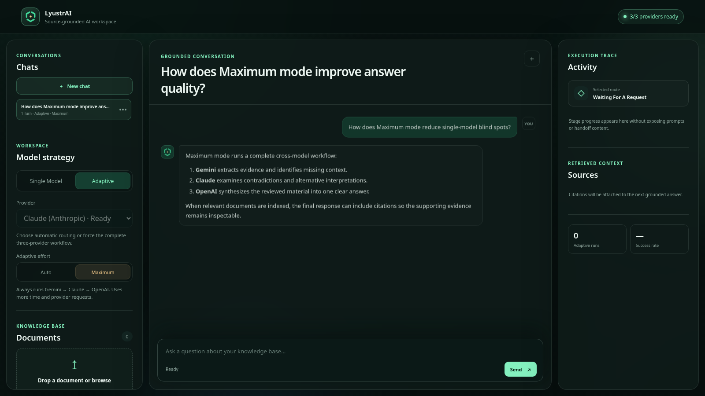
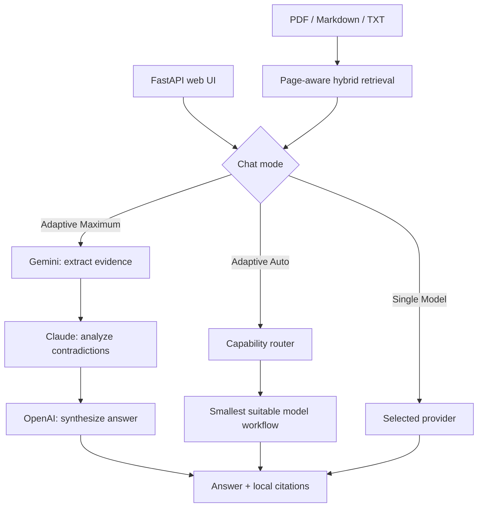

# LyustrAI

**Multiple models. One refined answer.**

LyustrAI coordinates Gemini, Claude (Anthropic), and OpenAI through evidence
extraction, contradiction-aware analysis, and final synthesis. `Maximum` mode
always runs the complete three-stage workflow to reduce single-model blind
spots. When relevant documents are indexed, citations make the supporting
evidence inspectable.

[](https://github.com/SunnatBEK-dev/lyustrAI/actions/workflows/ci.yml)
[](docs/evaluation-report.md)
[](pyproject.toml)
[](LICENSE)

> A local, single-user BYOK system built around explicit provider contracts,
> measurable routing and retrieval, safe workflow control, and honest
> limitations.



_Interface shown with synthetic local demo data._

## What it demonstrates

- **Adaptive Multi-Model orchestration:** `Auto` uses a deterministic capability
  router to select an efficient workflow across Gemini, Claude (Anthropic), and
  OpenAI.
- **Complete `Maximum` workflow:** Gemini extracts evidence and missing context,
  Claude performs contradiction-aware analysis, and OpenAI synthesizes one
  clear final answer.
- **Inspectable supporting evidence:** when relevant indexed documents are
  available, source cards and page-aware citations expose the basis used for
  the answer.
- **Document intelligence:** Markdown, TXT, and text-based PDF ingestion feeds
  hybrid semantic + BM25 retrieval with rank fusion.
- **Flexible conversations:** use one selected provider or an Adaptive mode,
  switch strategies inside a saved chat, and keep separate chat histories
  isolated.
- **Engineering reliability:** explicit provider contracts, validated handoffs,
  bounded retries, ordered SSE progress, cooperative cancellation, content-free
  metrics, reproducible evaluations, CI, and Docker.

## Quickstart

```bash
git clone https://github.com/SunnatBEK-dev/lyustrAI.git
cd lyustrAI
python -m venv .venv
source .venv/bin/activate
python -m pip install -e '.[embeddings,documents,web]'
cp .env.example .env
lyustrai
```

Open <http://127.0.0.1:8000>. The status page and document catalog are safe to
open without provider keys. Configure `.env` for the mode you want to use:

| Mode | Required configuration |
| --- | --- |
| Single Model | One matching key and model pair, such as `OPENAI_API_KEY` + `OPENAI_MODEL` |
| Adaptive Multi-Model | `ANTHROPIC_API_KEY`, `ANTHROPIC_MODEL`, `OPENAI_API_KEY`, `OPENAI_MODEL`, `GEMINI_API_KEY`, and `GEMINI_MODEL` |

Never commit `.env`. The first document indexing run downloads the configured
local embedding model, so initial setup can take longer than later starts.

Alternatively, start the same local demo in a non-root container:

```bash
docker compose up --build
```

## Product flow



`Maximum` always follows the central Gemini → Claude → OpenAI path. `Auto`
selects the smallest suitable route, while indexed documents supply the same
hybrid retrieval layer to every mode. Each user-created chat has its own local
history, and switching provider or mode inside that chat continues the same
context without mixing it with other chats.

## Web API

| Method | Endpoint | Purpose |
| --- | --- | --- |
| `GET` | `/api/status` | Secret-free provider readiness and bounded metrics |
| `GET/POST` | `/api/documents` | List or index PDF, Markdown, and TXT documents |
| `DELETE` | `/api/documents/{document_id}` | Remove one source from the index |
| `POST` | `/api/chat/stream` | SSE route, stage, citation, answer, and error events |
| `POST` | `/api/runs/{run_id}/cancel` | Request cooperative cancellation |
| `GET` | `/api/conversations` | List saved chats by most recent activity |
| `GET` | `/api/conversations/{conversation_id}` | Load one chat and its messages |
| `PATCH` | `/api/conversations/{conversation_id}` | Rename one chat |
| `DELETE` | `/api/conversations/{conversation_id}` | Permanently delete one chat history |

`POST /api/chat/stream` accepts an optional `conversation_id`. Omitting it
creates a chat on the first submitted message; providing it continues that
chat. The stream returns the resolved ID in both `X-Conversation-ID` and the
initial `run` event. Adaptive requests accept `adaptive_strategy: auto|maximum`;
omission defaults to `auto`.

Interactive OpenAPI documentation is available at `/api/docs`.

## Reproduce the evidence

```bash
# Default unit suite; never calls a paid API
pytest

# Offline multi-component workflows
pytest -m integration

# Coverage gate
pytest --cov=ai_sdk --cov-report=term-missing

# Semantic vs hybrid retrieval + route benchmark
python app/evaluate_knowledge.py

# Tracked runtime-data and secret audit
python app/audit_repository.py
```

Real provider smoke tests require both a key and an explicit
`RUN_<PROVIDER>_INTEGRATION=1` flag. Normal CI never enables those flags.

## Engineering decisions

1. **Explicit contracts over orchestration magic.** Provider adapters translate
   one model turn; retrieval, tools, agents, and handoffs remain testable without
   a vendor SDK.
2. **Deterministic routing over another router model call.** The selected route
   is cheap, explainable, and regression-testable, with known ambiguity limits.
3. **One retry owner and safe cancellation boundaries.** Hidden provider retries
   are disabled, permanent failures are not retried, and cancellation does not
   pretend to interrupt an in-flight blocking provider request.

The full rationale is in [engineering decisions](docs/engineering-decisions.md).

## Current boundaries

Version 0.1.0 is a **local, single-user BYOK application**. It is not a
hosted multi-tenant SaaS. Authentication, billing, PostgreSQL, queues,
Kubernetes, Office parsing, OCR, fine-tuning, malware scanning, and public abuse
controls are intentionally out of scope. Generated-answer correctness still
needs a human-labeled dataset and calibrated judge before it can be claimed as
a benchmark.

## Documentation

- [Capabilities and SDK reference](docs/capabilities.md)
- [Evaluation report](docs/evaluation-report.md)
- [Knowledge corpus](docs/knowledge_base)
- [Engineering decisions](docs/engineering-decisions.md)
- [Security policy](SECURITY.md)
- [Release notes](docs/release-notes-v0.1.0.md)
- [Contributing](CONTRIBUTING.md)

## License

MIT © 2026 Sunnatbek. See [LICENSE](LICENSE).
